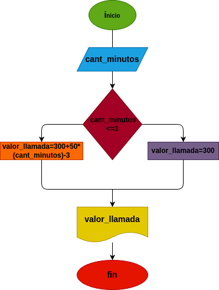

# Condicionales_1

## Costo de una llamada telefonica 

ingresar el tiempo de duracion de una llamada telefonica y determinar la cantidad a pagar, de acuerdo con lo siguiente:
- Toda llamada que dure 3 minutos o menos tiene un costo de $300 pesos.
- cada minuto adicional cuesta $50 pesos.

## inpud

### variable de entrada
cant_minutos: cantidad de minutos que duro la llamada
### prosesing
valor_llamada: calcular el valor final de la llamada

si es menor o igual a 3 minutos: el valor finalserade $300 pesos

si es mayor a 3 minutos: 300+50*(cant_minutos-3)

### output
valor llamada
# Diseño

# construccion